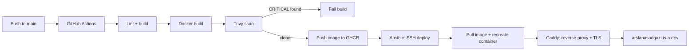

# Arslan Asad Qazi — Portfolio

Personal portfolio, built to also work as a working example of the DevOps
practices it talks about: containerized, scanned, and deployed through a
real pipeline rather than a one-click hosting button.

Live at [arslanasadqazi.is-a.dev](https://arslanasadqazi.is-a.dev) — see
the "How This Is Deployed" section on the site itself for the write-up.

## Stack

- **App**: Next.js (App Router) + TypeScript + Tailwind CSS
- **Container**: Docker, multi-stage build, `output: "standalone"`
- **CI**: GitHub Actions — lint, build, Trivy scan, push to GHCR
- **CD**: Ansible — runs on every push, not just once at setup
- **Reverse proxy / TLS**: Caddy
- **Host**: a single Oracle Cloud compute VM

Why each of these and not the alternatives is written up in
[`docs/adr/`](docs/adr/).

## Architecture



## Local development

```bash
npm install
npm run dev
```

## Running with Docker

```bash
docker build -t portfolio .
docker run -p 3000:3000 portfolio

# or, for local dev / VM deploy parity:
docker compose up --build
```

## Project layout

```
src/                  Next.js app (App Router)
docs/adr/             Architecture decision records
ansible/deploy.yml    Deploy playbook — runs on every push
Caddyfile             Reverse proxy + automatic HTTPS config
Dockerfile            Multi-stage build for a small runtime image
docker-compose.yml    Used both for local dev and on the VM
.github/workflows/    CI/CD pipeline
```

## Deployment

CI/CD is handled by [`.github/workflows/ci-cd.yml`](.github/workflows/ci-cd.yml):

1. Lint and build the app.
2. Build the Docker image.
3. Scan it with [Trivy](https://github.com/aquasecurity/trivy) — the build
   fails on any CRITICAL vulnerability.
4. Push the image to GHCR, tagged with the commit SHA.
5. Run [`ansible/deploy.yml`](ansible/deploy.yml) over SSH against the VM,
   which pulls the new image, recreates the container, and reloads Caddy.

Required repository secrets:

- `VM_HOST` — the VM's public IP
- `VM_SSH_KEY` — private key for the deploy user
- `GHCR_PULL_TOKEN` — a classic PAT with `read:packages`, used by Ansible to
  log in to GHCR on the VM before pulling (the image is private)
